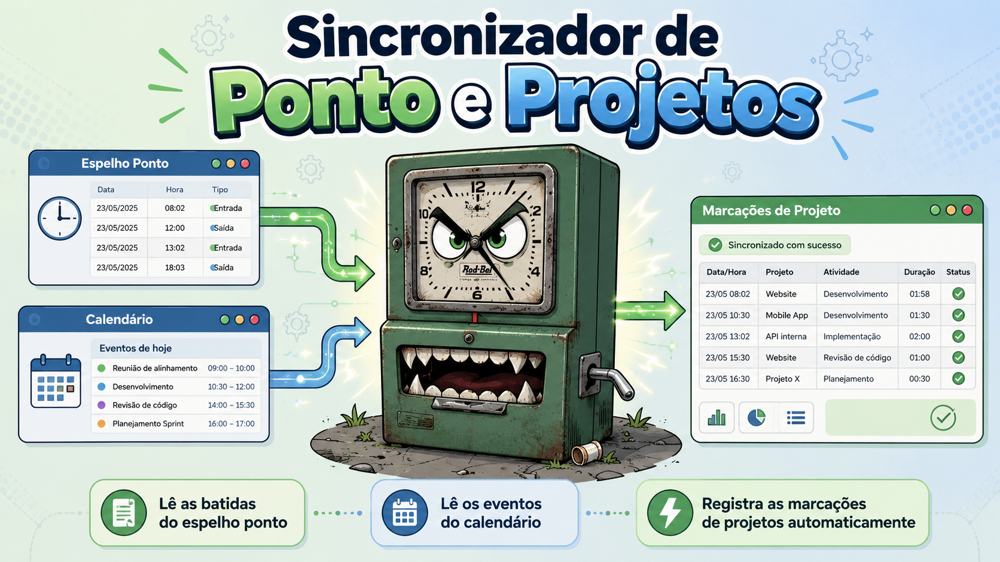

# Ponto na Certi



Extensão para Google Chrome que simplifica o apontamento de horas em projetos na
Fundação CERTI. Ela reúne as informações do ponto e da agenda, permite revisar a
distribuição das horas e envia ao Channel somente as marcações autorizadas pelo
usuário.

O fluxo integra três sistemas:

- lê as batidas do espelho de ponto no Ahgora;
- lê eventos do Google Calendar;
- compara as horas calculadas com os apontamentos existentes;
- registra no Channel as marcações de projetos revisadas e selecionadas pelo
  usuário.

A extensão reutiliza as sessões autenticadas no navegador e apresenta uma prévia
antes de qualquer gravação. Ela não solicita nem armazena credenciais.

## O mascote

Nosso mascote é aquele relógio de ponto que já viu horas extras demais e resolveu
tomar uma atitude: em vez de ficar só marcando entrada e saída, agora ele corre
atrás do Ahgora, confere a agenda no Google Calendar e entrega tudo organizado no
Channel. A cara de poucos amigos é só pose — no fundo, ele está aqui para encarar a
parte repetitiva do apontamento e deixar você apenas com o que realmente importa:
revisar, confirmar e seguir o dia.

## Funcionalidades

- **Conexão integrada:** conecta Ahgora, Channel e Google Calendar de uma só vez.
- **Google Calendar:** detecta e reconhece automaticamente eventos do calendario usando um conjunto de regras pré configuradas.
- **Fluxo guiado:** organiza o uso em Conectar, Regras, Capturar, Revisar e Enviar.
- **Captura automática:** reúne e compara os dados dos três sistemas.
- **Períodos flexíveis:** permite escolher um mês ou intervalo de datas.
- **TAGs:** associa projetos e atividades do Channel às marcações.
- **Templates e regras:** reutiliza divisões e automatiza marcações recorrentes.
- **Revisão:** mostra horas, eventos, divergências e bloqueios antes do envio.
- **Divisão de horas:** distribui o dia por percentual ou duração.
- **Envio seguro:** envia somente as marcações revisadas e selecionadas.
- **Privacidade:** reutiliza as sessões abertas sem armazenar credenciais.

## Segurança

- A extensão não solicita nem armazena senhas e não lê cookies; no modo API, o
  token do Google é administrado pelo Chrome e não é salvo pela aplicação.
- As permissões são limitadas aos sistemas integrados e solicitadas somente quando
  necessárias.
- O acesso ao Google Calendar é somente para leitura.
- Nenhuma marcação é enviada ao Channel sem revisão e confirmação do usuário.
- Os envios são realizados um de cada vez e interrompidos se houver uma resposta
  inesperada, reduzindo o risco de duplicidade.
- Configurações, TAGs, templates e regras ficam armazenados localmente no navegador.

## Screenshots

As telas abaixo apresentam o fluxo principal da extensão, da conexão com os
sistemas até o envio das marcações revisadas ao Channel.

<table>
  <tr>
    <td width="50%" valign="top">
      
      <br />
      <strong>Visão geral</strong><br />
      Preferências rápidas e acompanhamento das cinco etapas da operação.
    </td>
    <td width="50%" valign="top">
      
      <br />
      <strong>Conexões</strong><br />
      Status independente do Ahgora, Channel e Google Calendar.
    </td>
  </tr>
  <tr>
    <td width="50%" valign="top">
      
      <br />
      <strong>Regras</strong><br />
      Acesso aos gerenciadores de TAGs, templates, automações e catálogos RAG.
    </td>
    <td width="50%" valign="top">
      
      <br />
      <strong>Captura e comparação</strong><br />
      Progresso separado das três fontes e da preparação dos dados para revisão.
    </td>
  </tr>
  <tr>
    <td width="50%" valign="top">
      
      <br />
      <strong>Revisão dos apontamentos</strong><br />
      Comparação diária, escolha da marcação e divisão por percentual ou duração.
    </td>
    <td width="50%" valign="top">
      
      <br />
      <strong>Envio ao Channel</strong><br />
      Confirmação final, progresso do envio e opção para cancelar a operação.
    </td>
  </tr>
</table>

## Extensão Chrome

O código, os comandos de desenvolvimento, a documentação de permissões e as
instruções completas de instalação estão em
[`apps/chrome-extension`](apps/chrome-extension/README.md).

Início rápido:

```bash
cd apps/chrome-extension
npm ci
npm run build
```

Depois, abra `chrome://extensions`, habilite o modo do desenvolvedor e carregue a
pasta `apps/chrome-extension/dist` sem compactação.

## Sistemas integrados

- **Ahgora:** leitura do espelho de ponto;
- **Google Calendar:** leitura de calendários e eventos;
- **Channel:** leitura, comparação e registro das marcações de projetos.

## Licença

Distribuído sob a licença MIT. Consulte [`LICENSE`](LICENSE).
